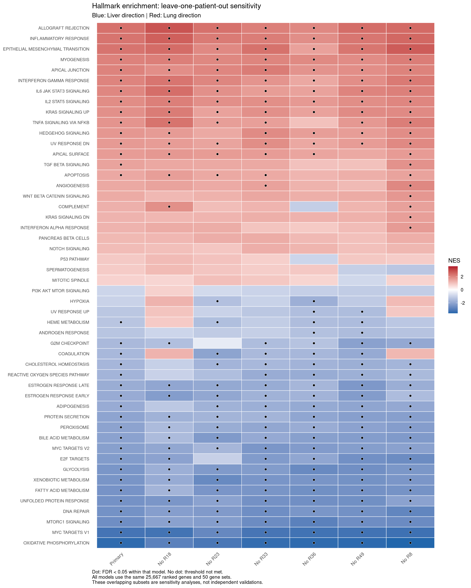

# Paired RNA-seq analysis of liver and lung breast cancer metastases

## Research question
How do transcriptomic profiles differ between liver and lung metastases within the same patients?

## Dataset and methods
- Source: NCBI GEO GSE316391.
- Six patients and 12 matched biological specimens.
- Library replicate counts were summed at the specimen level.
- Genes retained: count >= 10 in at least six specimens.
- DESeq2 design: ~ patient_code + tissue.
- Contrast: Lung versus Liver; positive values indicate Lung direction.
- Hallmark GSEA used signed Wald statistics and MSigDB 2026.1.Hs.

## Main findings
- 25,667 genes analyzed.
- 1,617 genes with FDR < 0.05: 1,212 Lung-direction and 405 Liver-direction.
- 36 primary-significant Hallmark gene sets.
- 24 retained direction and FDR < 0.05 in all six patient-exclusion models.
- Oxidative phosphorylation and MYC targets V1: Liver direction.
- Inflammatory response and EMT: Lung direction.

## Interpretation limits
Bulk tissue composition may contribute to the differences. Tumor-content metadata were available only for R49. Twelve genes retain unresolved apeglm optimization sensitivity; their shrunken estimates are not used for definitive effect-size prioritization. Patient-exclusion models are sensitivity analyses, not independent validations.

## Hallmark sensitivity across patient exclusions

Blue indicates Liver-direction enrichment; red indicates Lung direction.
Dots mark FDR < 0.05 within each model. Patient-exclusion models
assess sensitivity within this cohort, not independent validation.

## Documentation
- [Results report](docs/results_report.md)
- [Analysis plan](docs/analysis_plan.md)
- [QC decisions](docs/qc_decisions.md)
- [Cell-composition interpretation](docs/cell_composition_interpretation.md)

## Workflow
Numbered R scripts are in scripts/. Run from the project root with prepared inputs. Tables and figures are in results/. The workflow was rerun in a separate working directory in the same R/package environment. After a normalization correction, stages 16-18 were rerun and numerical comparisons passed. See [reproducibility verification](docs/reproducibility.md).
